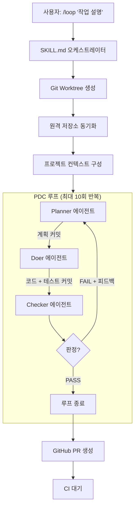

[English](README.md) | [한국어](README.ko.md)

# Looper

**[Claude Code](https://docs.anthropic.com/en/docs/claude-code)를 위한 Plan-Do-Check 루프 오케스트레이터**

세 개의 AI 에이전트(Planner, Doer, Checker)가 코드가 모든 검증을 통과할 때까지 반복하고, 자동으로 PR을 생성합니다.

[](.claude-plugin/plugin.json)
[](LICENSE)
[](.github/workflows/ci.yml)

---

## Looper란?

Looper는 개발 전체 사이클을 자동화하는 Claude Code 플러그인입니다. 작업 설명만 입력하면:

1. **Plan(계획)** — 코드베이스를 탐색하고 상세한 구현 계획을 작성
2. **Do(실행)** — 코드와 테스트를 작성하고 모든 검증을 실행
3. **Check(검증)** — 작업을 리뷰하고, 문제를 수정하고, PASS/FAIL 판정을 내림
4. **반복** — FAIL이면 피드백을 반영하여 PASS할 때까지 반복
5. **배포** — PASS하면 아키텍처 다이어그램이 포함된 GitHub PR을 자동 생성

수동 개입 없이, 원하는 것을 설명하기만 하면 Looper가 나머지를 처리합니다.

---

## 주요 기능

- **자동 PDC 루프** — Plan-Do-Check 에이전트가 품질이 통과할 때까지 반복
- **PM Agent 대시보드** — AI 기반 태스크 분해로 복잡한 작업을 서브태스크로 자동 분배
- **자동 기술 스택 감지** — Node.js, Python, Go, Rust, .NET 등 지원
- **자동 품질 검증** — 테스트, 린팅, 타입 체크, 포매팅, 보안 스캔
- **Git 기반 상태 관리** — 구조화된 트레일러가 포함된 Conventional Commits로 진행 상황 추적
- **자동 PR 생성** — Mermaid 아키텍처 다이어그램과 테스트 결과가 포함된 PR
- **격리된 Worktree** — 각 태스크가 독립된 git worktree에서 실행
- **이어하기 지원** — 중단된 루프를 마지막 이터레이션부터 재개

---

## 빠른 시작

### 1. 설치

```bash
claude plugin install code-salad/looper
```

### 2. 첫 루프 실행

```
/looper:loop "로그인 엔드포인트에 입력 유효성 검증 추가"
```

### 3. 작동 확인

Looper가 git worktree를 생성하고, PDC 루프를 실행하고, 완료되면 PR을 생성합니다. 각 이터레이션의 커밋을 확인할 수 있습니다:

```bash
git log --grep="Loop-Phase:" --oneline
```

---

## 활용 사례

### 기능 개발 자동화

> "하나의 프롬프트로 완전한 기능을 구현합니다."

```
/looper:loop "Google과 GitHub 프로바이더를 사용한 OAuth2 로그인 추가"
```

Planner 에이전트가 코드베이스를 탐색하고 인증 모듈을 파악하여 단계별 계획을 작성합니다. Doer가 라우트, 미들웨어, 테스트를 구현합니다. Checker가 전체 동작을 검증합니다.

### 버그 수정 자동화

> "버그를 설명하면, 테스트가 포함된 수정을 받습니다."

```
/looper:loop "연결 타임아웃 시 워커 풀의 메모리 누수 수정"
```

Looper가 버그를 분석하고, 근본 원인을 파악하고, 수정을 구현하고, 회귀 테스트를 작성하고, 기존 테스트가 모두 통과하는지 검증합니다.

### 리팩토링 자동화

> "자신 있게 코드를 재구성합니다."

```
/looper:loop "인증 모듈을 콜백에서 async/await로 리팩토링하고 에러 처리 개선"
```

Planner가 영향받는 모든 파일을 매핑하고, Doer가 체계적으로 리팩토링하고, Checker가 회귀가 없는지 확인합니다.

### PR 자동 생성 + 아키텍처 다이어그램

> "시각적 문서가 포함된 전문적인 PR을 생성합니다."

```
/looper:create-github-pr
```

다음 내용이 포함된 종합적인 PR을 생성합니다:
- 문제 설명
- Before/After Mermaid 아키텍처 다이어그램
- 주요 변경 사항 설명
- 테스트 결과 및 CI 상태

### 자동 코드 리뷰

> "5개의 전문 리뷰어에 의한 AI 기반 리뷰."

매 이터레이션마다 Checker 에이전트가 5개의 병렬 리뷰 서브에이전트를 실행합니다:
- **Type Checker** — 타입 안전성과 빌드 성공 검증
- **Test Checker** — 테스트 커버리지 검증 (누락된 테스트 = BLOCKER)
- **Logic Reviewer** — 정확성과 엣지 케이스 검사
- **Code Quality** — 린트, 포맷, 보안 스캔, 컨벤션 준수
- **Integration Tester** — 개발 서버 시작 후 엔드포인트 테스트

### GitHub 이슈 자동 생성

> "설명만으로 구조화된 버그 리포트를 생성합니다."

```
/looper:github-bug-report "페이지네이션과 필터를 함께 사용할 때 검색 결과에 중복이 발생"
```

저장소의 이슈 템플릿을 감지하고, 환경 정보를 채우고, 중복을 확인하고, 체계적인 이슈를 생성합니다.

### 멀티 언어 프로젝트 지원

Looper는 기술 스택을 자동 감지하고 적절한 도구를 사용합니다:

| 언어 | 테스트 러너 | 린터 | 포매터 | 타입 체커 | 빌드 |
|------|-----------|------|-------|----------|------|
| TypeScript/JS | vitest, jest, mocha | eslint, biome | prettier, biome | tsc | vite, webpack, esbuild |
| Python | pytest | ruff, flake8 | black, ruff | mypy, pyright | — |
| Go | go test | golangci-lint | gofmt | go vet | go build |
| Rust | cargo test | clippy | rustfmt | cargo check | cargo build |
| C#/.NET | dotnet test | dotnet format | dotnet format | dotnet build | dotnet build |

---

## 작동 원리



### 상태 관리

모든 상태는 구조화된 트레일러가 포함된 git 커밋에 저장됩니다:

```
feat(add-auth): OAuth2 로그인 흐름 구현

Google과 GitHub OAuth 프로바이더 및 세션 관리를 추가했습니다.

Loop-Phase: do
Loop-Iteration: 2
```

git으로 루프 진행 상황을 조회할 수 있습니다:

```bash
# 모든 계획 커밋
git log --grep="Loop-Phase: plan" --oneline

# 특정 이터레이션
git log --grep="Loop-Iteration: 2" --oneline

# PASS 판정 찾기
git log --grep="Loop-Verdict: PASS" --format="%B" -1
```

---

## 아키텍처

### 에이전트

| 에이전트 | 모델 | 역할 | 도구 |
|---------|------|------|------|
| **Planner** | Opus | 코드베이스 탐색, 실행 가능한 계획 작성 | Read, Glob, Grep, Bash (읽기 전용) |
| **Doer** | Sonnet | 계획 구현, 테스트 작성, 검증 실행 | Read, Write, Edit, Bash, Glob, Grep |
| **Checker** | Opus | 작업 리뷰, PASS/FAIL 판정 | Read, Bash, Glob, Grep |

### 스킬(Skills)

| 스킬 | 명령어 | 설명 |
|------|-------|------|
| Loop | `/looper:loop "작업"` | 메인 PDC 루프 오케스트레이터 |
| Git Commit | `/looper:git-commit` | Conventional Commit 헬퍼 |
| Create PR | `/looper:create-github-pr` | 아키텍처 다이어그램 포함 PR |
| Bug Report | `/looper:github-bug-report "설명"` | GitHub 이슈 생성 |
| Worktree | `/looper:initiate-worktree "이름"` | Git worktree 헬퍼 |

### 유틸리티 스크립트

모든 스크립트가 기술 스택을 자동 감지하고 적절한 도구로 실행합니다:

| 스크립트 | 기능 |
|---------|------|
| `detect-stack` | 프로젝트 기술 스택 자동 감지 (JSON) |
| `run-tests` | 테스트 스위트 실행 |
| `run-lint` | 린터 실행 (`--fix` 지원) |
| `run-typecheck` | 타입 체커 실행 |
| `run-format` | 포매터 실행 (`--fix` 지원) |
| `run-build` | 프로젝트 빌드 |
| `install-deps` | 의존성 설치 |
| `security-scan` | 보안 취약점 스캔 |

---

## 칸반 대시보드

Looper에는 시각적 태스크 관리와 루프 모니터링을 위한 웹 기반 칸반 대시보드가 포함되어 있습니다.

### 실행 방법

```bash
cd dashboard
npm install
npm start
# http://localhost:3000 열기
```

### 기능

- **칸반 보드** — Backlog, Planning, In Progress, Review, Done 컬럼 간 드래그 앤 드롭
- **PM Agent** — 상위 수준 프롬프트를 입력하면 AI가 서브태스크로 자동 분해
- **실시간 루프 모니터링** — WebSocket을 통해 에이전트 진행 상황을 실시간으로 확인
- **루프 히스토리** — 이터레이션 상세 정보와 함께 모든 과거 루프 조회
- **분석(Analytics)** — 성공률, 평균 이터레이션 수, 태스크 분포
- **다크/라이트 모드** — Pretendard 폰트의 Enterprise SaaS급 UI
- **EN/KO** — 완전한 이중 언어 지원

---

## 설정

| 환경 변수 | 기본값 | 설명 |
|----------|-------|------|
| `LOOPER_MAX_ITERATIONS` | `10` | 최대 PDC 루프 반복 횟수 |

```bash
LOOPER_MAX_ITERATIONS=5 claude
```

---

## 요구 사항

- [`claude` CLI](https://docs.anthropic.com/en/docs/claude-code) (Claude Code)
- `git`
- `jq`
- `gh` (GitHub CLI, 선택 — PR 생성에 필요)
- `node` (선택 — 대시보드에 필요)

## 라이선스

MIT
