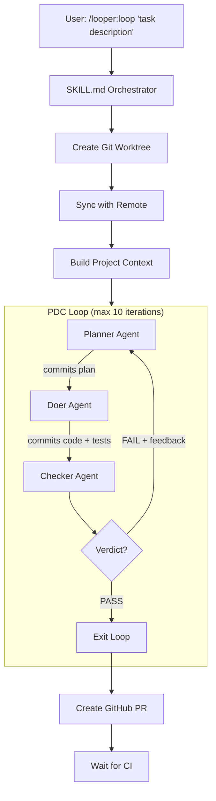

# Looper

**Plan-Do-Check loop orchestrator for [Claude Code](https://docs.anthropic.com/en/docs/claude-code)**

Three AI agents — Planner, Doer, Checker — iterate in a loop until your code passes all checks, then automatically create a PR.

[](.claude-plugin/plugin.json)
[](LICENSE)
[](.github/workflows/ci.yml)

---

## What is Looper?

Looper is a Claude Code plugin that automates the full development cycle. Give it a task description, and it will:

1. **Plan** — Explore your codebase and produce a detailed implementation plan
2. **Do** — Write the code, tests, and run all checks
3. **Check** — Review the work, fix issues, and issue a PASS/FAIL verdict
4. **Repeat** — If FAIL, iterate with feedback until it passes
5. **Ship** — On PASS, automatically create a GitHub PR with architecture diagrams

No manual intervention required. Just describe what you want, and Looper handles the rest.

---

## Key Features

- **Automated PDC Loop** — Plan-Do-Check agents iterate until quality passes
- **Auto Tech Stack Detection** — Supports Node.js, Python, Go, Rust, .NET, and more
- **Automated Quality Gates** — Tests, linting, type checking, formatting, security scanning
- **Git-Based State** — All progress tracked via conventional commits with structured trailers
- **Auto PR Creation** — PRs with Mermaid architecture diagrams and test results
- **Isolated Worktrees** — Each task runs in its own git worktree
- **Resume Support** — Pick up interrupted loops from the last iteration
- **Issue Automation** — Auto-pick GitHub issues and work on them end-to-end
- **Multi-Plugin Marketplace** — Modular plugin architecture with MCP server integration

---

## Quick Start

### 1. Install

```bash
claude plugin install code-salad/looper
```

### 2. Run your first loop

```
/looper:loop "add input validation to the login endpoint"
```

### 3. Watch it work

Looper creates a git worktree, runs the PDC loop, and creates a PR when done. Each iteration produces conventional commits you can inspect:

```bash
git log --grep="Loop-Phase:" --oneline
```

---

## Use Cases

### Automate Feature Development

> "Build a complete feature from a single prompt."

```
/looper:loop "add OAuth2 login with Google and GitHub providers"
```

The Planner agent explores your codebase, identifies the auth module, and produces a step-by-step plan. The Doer implements routes, middleware, and tests. The Checker verifies everything works end-to-end.

### Automate Bug Fixes

> "Describe the bug, get a tested fix."

```
/looper:loop "fix memory leak in the worker pool when connections timeout"
```

Looper analyzes the bug, identifies root cause, implements the fix, writes regression tests, and verifies all existing tests still pass.

### Automate Refactoring

> "Restructure code with confidence."

```
/looper:loop "refactor auth module from callbacks to async/await with proper error handling"
```

The Planner maps all affected files, the Doer refactors systematically, and the Checker ensures no regressions.

### Auto-Generate PRs with Architecture Diagrams

> "Professional PRs with visual documentation."

```
/looper:create-github-pr
```

Creates a comprehensive PR with:
- Problem statement
- Before/After Mermaid architecture diagrams
- Key changes walkthrough
- Test results and CI status

### Automated Code Review

> "AI-powered review with 5 specialized reviewers."

Every iteration, the Checker agent spawns 5 parallel review subagents:
- **Type Checker** — Verifies type safety and build success
- **Test Checker** — Validates test coverage (missing tests = BLOCKER)
- **Logic Reviewer** — Checks correctness and edge cases
- **Code Quality** — Lint, format, security scan, conventions
- **Integration Tester** — Starts dev server and tests endpoints

### Automated Issue Processing

> "Point Looper at your GitHub repo and let it work issues automatically."

```
/looper:looper-issue
```

Looper finds an open, unassigned issue, assigns it to you, runs the full PDC loop, and opens a PR — all without manual intervention. Use `looper-watch` to poll continuously:

```
/looper:looper-watch owner/repo 30
```

### Multi-Language Project Support

Looper auto-detects your tech stack and uses the right tools:

| Language | Test Runner | Linter | Formatter | Type Checker | Build |
|----------|-------------|--------|-----------|-------------|-------|
| TypeScript/JS | vitest, jest, mocha | eslint, biome | prettier, biome | tsc | vite, webpack, esbuild |
| Python | pytest | ruff, flake8 | black, ruff | mypy, pyright | — |
| Go | go test | golangci-lint | gofmt | go vet | go build |
| Rust | cargo test | clippy | rustfmt | cargo check | cargo build |
| C#/.NET | dotnet test | dotnet format | dotnet format | dotnet build | dotnet build |

---

## How It Works



### State Management

All state is stored in git commits with structured trailers:

```
feat(add-auth): implement OAuth2 login flow

Added Google and GitHub OAuth providers with session management.

Loop-Phase: do
Loop-Iteration: 2
```

Query loop progress with git:

```bash
# All plan commits
git log --grep="Loop-Phase: plan" --oneline

# Specific iteration
git log --grep="Loop-Iteration: 2" --oneline

# Find the PASS verdict
git log --grep="Loop-Verdict: PASS" --format="%B" -1
```

---

## Architecture

### Plugins

Looper uses a multi-plugin marketplace architecture. Three plugins ship together:

| Plugin | Description |
|--------|-------------|
| **looper** | Core PDC loop — agents, skills, and scripts |
| **fallback-agent** | MCP server (Rust) enabling nested subagent spawning from within Claude Code |
| **webscraping** | Web scraping agents and skills for gathering context from URLs |

Each plugin lives under `plugins/<name>/` and can be installed independently.

### MCP Servers

| Server | Plugin | Purpose |
|--------|--------|---------|
| **fallback-agent** | fallback-agent | Provides the `AgentFallback` tool for spawning nested Claude subagents |

### Agents

| Agent | Model | Role | Tools |
|-------|-------|------|-------|
| **Planner** | Opus | Explores codebase, produces actionable plan | Read, Glob, Grep, Bash (read-only) |
| **Doer** | Sonnet | Implements plan, writes tests, runs checks | Read, Write, Edit, Bash, Glob, Grep |
| **Checker** | Opus | Reviews work, issues PASS/FAIL verdict | Read, Bash, Glob, Grep |
| **Issue Creator** | Sonnet | Creates GitHub issues for discovered bugs or improvements | Bash, Read |

### Skills

| Skill | Command | Description |
|-------|---------|-------------|
| Loop | `/looper:loop "task"` | Main PDC loop orchestrator |
| Git Commit | `/looper:git-commit` | Conventional commit helper |
| Create PR | `/looper:create-github-pr` | PR with architecture diagrams |
| Worktree | `/looper:initiate-worktree "name"` | Git worktree helper |
| Claude Wrap | `/looper:claude-wrap` | Spawn a nested Claude CLI instance from within Claude Code |
| Looper EE | `/looper:looper-ee <issue_url>` | Work on a GitHub issue from an external repo |
| Looper Issue | `/looper:looper-issue` | Auto-pick an open GitHub issue and work on it |
| Looper Watch | `/looper:looper-watch <owner/repo> [interval]` | Poll a GitHub repo and work issues automatically |

### Utility Scripts

All scripts live in `plugins/looper/skills/looper/scripts/` and auto-detect your tech stack:

| Script | Purpose |
|--------|---------|
| `detect-stack` | Auto-detect project tech stack (JSON) |
| `detect-resume` | Detect and resume interrupted loops |
| `git-commit-loop` | Create commits with loop trailers |
| `git-loop-context` | Read prior loop iterations from git log |
| `run-tests` | Run test suite |
| `run-lint` | Run linter (with `--fix`) |
| `run-typecheck` | Run type checker |
| `run-format` | Run formatter (with `--fix`) |
| `run-build` | Build the project |
| `install-deps` | Install dependencies |
| `security-scan` | Security vulnerability scan |
| `setup-worktree` | Create or resume a git worktree for a task |
| `sync-with-remote` | Sync worktree with remote branch |

---

## Configuration

| Environment Variable | Default | Description |
|---------------------|---------|-------------|
| `LOOPER_MAX_ITERATIONS` | `10` | Maximum PDC loop iterations |

```bash
LOOPER_MAX_ITERATIONS=5 claude
```

---

## Requirements

- [`claude` CLI](https://docs.anthropic.com/en/docs/claude-code) (Claude Code)
- `git`
- `jq`
- `gh` (GitHub CLI, optional — required for PR creation and issue automation)

## Contributing

See [CONTRIBUTING.md](CONTRIBUTING.md) for development setup, code style, and PR process.

## License

MIT
