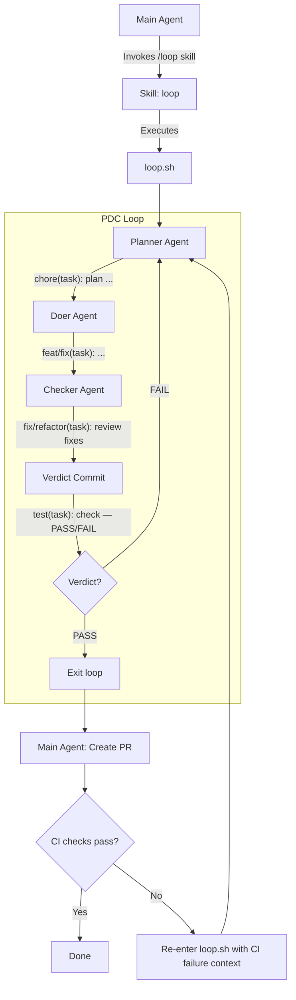

# PDC Loop — Plan, Do, Check

An orchestrated agent loop that iterates through three phases (Plan → Do → Check)
until the Checker agent returns PASS. Designed for Claude Code's constraint that
subagents cannot spawn subagents — the loop controller is a bash script.

---

## Architecture Overview

```
┌─────────────────────────────────────────────────────────┐
│  Main Agent (user's Claude Code session)                │
│                                                         │
│  1. User invokes /loop skill                            │
│  2. Skill generates prompt + context                    │
│  3. Skill executes loop.sh                              │
└────────────────────┬────────────────────────────────────┘
                     │
                     ▼
┌─────────────────────────────────────────────────────────┐
│  loop.sh  (Bash orchestrator)                           │
│                                                         │
│  - Runs PDC loop until PASS                             │
│  - Reads verdict from git log                           │
│  - Exits with status code                               │
└────────────────────┬────────────────────────────────────┘
                     │
          ┌──────────┼──────────┐
          ▼          ▼          ▼
       Planner    Doer      Checker
       Agent      Agent      Agent
     (claude -p) (claude -p) (claude -p)
```

---

## Flow Diagram (Mermaid)



---

## Project Context Bootstrap

**Important:** `claude -p` does NOT auto-load `CLAUDE.md`. You must pass
`--setting-sources user,project` to load it. It does auto-inject
`.claude/settings.json`.

What `claude -p` does **not** inject are project docs that agents routinely
ignore: `CONTRIBUTING.md`, `README.md`, etc. These contain critical information —
how to build, test, lint, commit, file structure conventions — that agents
need to follow but never bother to read.

The bash orchestrator collects these **once at startup** and injects them
into every agent prompt as a preamble.

### What gets collected

Only files that `claude -p` does NOT already handle:

| File | Why |
|------|-----|
| `CONTRIBUTING.md` | How to build, test, lint, commit, PR conventions |
| `AGENTS.md` | Agent-specific instructions (if the project has them) |
| `README.md` | Project overview, architecture, getting started |
| `.github/PULL_REQUEST_TEMPLATE.md` | PR format expectations |
| `.editorconfig` | Indentation, line endings, charset |
| `package.json` → `scripts` | Available npm/pnpm/yarn scripts |
| `Makefile` → targets | Available make targets |
| `pyproject.toml` | Linter/formatter/build config |
| `Cargo.toml` → `[workspace]` | Workspace structure |

### Collection script (`build_project_context`)

```bash
build_project_context() {
    local ctx=""

    # Project docs that claude -p does NOT auto-inject
    for file in CONTRIBUTING.md AGENTS.md README.md \
                .github/PULL_REQUEST_TEMPLATE.md .editorconfig; do
        if [ -f "$file" ]; then
            ctx+="
---
## File: ${file}

$(cat "$file")
"
        fi
    done

    # Build/script config (extract relevant sections only)
    if [ -f "package.json" ]; then
        ctx+="
---
## Project scripts (from package.json)

$(node -e "const p=require('./package.json'); console.log(JSON.stringify(p.scripts||{},null,2))")
"
    fi

    if [ -f "Makefile" ]; then
        ctx+="
---
## Makefile targets

$(grep -E '^[a-zA-Z_-]+:' Makefile | sed 's/:.*//')
"
    fi

    if [ -f "pyproject.toml" ]; then
        ctx+="
---
## Python project config (from pyproject.toml)

$(cat pyproject.toml)
"
    fi

    echo "$ctx"
}
```

### How it's injected

The `PROJECT_CONTEXT` is prepended to every agent prompt:

```
<project-context>
${PROJECT_CONTEXT}
</project-context>

You MUST follow the conventions and instructions in <project-context>.
Pay special attention to CONTRIBUTING.md for build/test/lint/commit conventions.

---

<your actual phase prompt here>
```

`CLAUDE.md` is injected by `claude -p --setting-sources user,project` — no duplication.

### Checker verification against project context

The checker prompt explicitly includes:

```
When reviewing, verify that all changes comply with the project conventions
in <project-context>. Specifically check:
- Code style matches .editorconfig and linter config
- Test patterns match existing test conventions
- File organization matches project structure
- Dependencies installed using the project's package manager
If any convention is violated, fix it or flag it in your verdict.
```

---

## Components

### 1. Skill Entry Point (`/loop`)

The skill is invoked from the main Claude Code session. It:

- Accepts the user's task description
- Generates a sanitized task name (used as scope in commits)
- Produces a reference `loop.sh` invocation with all required arguments
- Main agent executes the bash script via Bash tool

### 2. Bash Orchestrator (`loop.sh`)

The bash script is the **loop controller**. It owns the iteration logic so that
no agent needs to spawn another agent.

```
Usage: loop.sh --task <task-name> --prompt <prompt>

Arguments:
  --task     Sanitized task name (used as conventional commit scope)
  --prompt   The original user prompt / task description
```

**Pseudocode:**

```bash
#!/usr/bin/env bash
set -euo pipefail

TASK_NAME="$1"
PROMPT="$2"
MAX_ITERATIONS=10
ITERATION=0

# --- BOOTSTRAP: Build project context ---
# Collect project rules/conventions ONCE, inject into every agent prompt.
# This ensures agents never ignore contributing guidelines, project conventions,
# or setup instructions.
PROJECT_CONTEXT=$(build_project_context)

while [ $ITERATION -lt $MAX_ITERATIONS ]; do
    ITERATION=$((ITERATION + 1))

    # --- PLAN PHASE ---
    # --agent planner loads .claude/agents/planner.md (static instructions)
    # --setting-sources user,project loads CLAUDE.md (not auto-loaded in -p mode)
    # --append-system-prompt-file injects dynamic per-iteration context
    # --max-turns 50 is a per-phase safety valve
    claude -p "..." --agent planner \
        --setting-sources user,project \
        --dangerously-skip-permissions --max-turns 50 \
        --append-system-prompt-file /tmp/pdc-context-planner.md
    # Agent commits with: chore(task): plan iteration N

    # --- DO PHASE ---
    claude -p "..." --agent doer \
        --setting-sources user,project \
        --dangerously-skip-permissions --max-turns 50 \
        --append-system-prompt-file /tmp/pdc-context-doer.md
    # Agent commits with: feat(task): implement ... (iteration N)

    # --- CHECK PHASE ---
    # Checker may produce multiple commits:
    #   0+ fix/style/refactor commits (review fixes)
    #   1  verdict commit (always last): test(task): check iteration N — PASS/FAIL
    claude -p "..." --agent checker \
        --setting-sources user,project \
        --dangerously-skip-permissions --max-turns 50 \
        --append-system-prompt-file /tmp/pdc-context-checker.md

    # --- EVALUATE VERDICT ---
    # Verdict is always the last commit made by the checker
    VERDICT=$(git log --grep="Loop-Verdict:" -1 --format="%B" | grep -oP 'Loop-Verdict: \K(PASS|FAIL)')
    if [ "$VERDICT" = "PASS" ]; then
        echo "PASS — exiting loop"
        exit 0
    fi
done

echo "FAIL — max iterations reached"
exit 1
```

### 3. Planner Agent

Invoked as `claude -p --agent planner`.

Agent definition: `.claude/agents/planner.md`

**Responsibilities:**
- Read prior iteration context from `git log`
- Explore the codebase using Explore subagents
- Produce a concrete, actionable plan
- Commit the plan (no code changes — plan lives in the commit message body)

**Allowed tools:** Read, Glob, Grep, Task, Bash (Write/Edit/NotebookEdit disallowed)

### 4. Doer Agent

Invoked as `claude -p --agent doer`.

Agent definition: `.claude/agents/doer.md`

**Responsibilities:**
- Read the plan from the latest planner commit (`git log`)
- Implement the plan — write code, edit files, run commands
- Use Explore subagents if needed to understand the codebase
- Commit all changes with a summary in the commit message body

**Allowed tools:** Read, Write, Edit, Bash, Glob, Grep, Task, NotebookEdit

### 5. Checker Agent (also: Reviewer)

Invoked as `claude -p --agent checker`.

Agent definition: `.claude/agents/checker.md`

The checker doubles as a **code reviewer**. It doesn't just evaluate — it fixes
what it can. Only issues it cannot resolve itself get escalated back to the
Planner as FAIL feedback.

**Responsibilities:**
- Read the full context from `git log` (plan + doer changes)
- Review the diff from the doer's commit(s)
- Run tests, linting, type checking as appropriate
- **Fix issues it finds** — style, lint, small bugs, missing edge cases, test gaps
- Commit each fix with the appropriate conventional commit type
- After all fixes, commit a **verdict** (PASS or FAIL) as the final commit
- PASS = task is complete, all issues either passed review or were fixed in-place
- FAIL = issues remain that the checker couldn't resolve itself; commit body
  contains actionable feedback for the next Planner iteration

**Allowed tools:** Read, Write, Edit, Bash, Glob, Grep, Task, NotebookEdit

---

## Commit Convention

All commits follow [Conventional Commits](https://www.conventionalcommits.org/)
with git trailers for loop metadata. The **type** reflects the nature of the
change, the **scope** is the task name, and trailers encode loop coordinates.

### Format

```
<type>(<scope>): <description>

<body>

Loop-Phase: plan|do|check
Loop-Iteration: <N>
Loop-Verdict: PASS|FAIL        # checker commits only
```

### Type Selection by Phase

| Phase   | Typical type | When to use |
|---------|-------------|-------------|
| Planner | `chore`     | Always — planning produces no code changes |
| Doer    | `feat`      | New functionality added |
| Doer    | `fix`       | Bug fix or correcting previous iteration |
| Doer    | `refactor`  | Restructuring without behavior change |
| Doer    | `test`      | Adding or updating tests |
| Doer    | `docs`      | Documentation only changes |
| Checker | `fix`       | Bug fix found during review |
| Checker | `style`     | Formatting, naming, code style cleanup |
| Checker | `refactor`  | Structural improvement found during review |
| Checker | `test`      | Adding missing test coverage |
| Checker | `test`      | **Verdict commit** — always the last checker commit |

The checker may produce **multiple commits**: zero or more fix/style/refactor/test
commits followed by exactly one verdict commit. The verdict commit is always last
and always uses type `test`.

### Examples

**Planner — iteration 1:**
```
chore(add-auth): plan input validation strategy

## Goal
Add server-side validation for login endpoint.

## Steps
1. Add zod schema for login request body
2. Add validation middleware to POST /auth/login
3. Add unit tests for edge cases (empty, malformed)

## Files to modify
- src/routes/auth.ts — add validation
- src/schemas/auth.ts — new file, zod schema
- tests/auth.test.ts — new test cases

Loop-Phase: plan
Loop-Iteration: 1
```

**Doer — iteration 1:**
```
feat(add-auth): add zod validation to login endpoint

- Created src/schemas/auth.ts with loginRequestSchema
- Added validation middleware in src/routes/auth.ts
- Added 4 unit tests in tests/auth.test.ts
- All tests passing (14/14)

Loop-Phase: do
Loop-Iteration: 1
```

**Checker review fix — iteration 1 (commit 1 of 3):**
```
style(add-auth): rename validateInput to validateLoginRequest

Renamed for clarity — function specifically validates login payloads,
not generic input.

- src/schemas/auth.ts — renamed export
- src/routes/auth.ts — updated import and usage
- tests/auth.test.ts — updated test descriptions

Loop-Phase: check
Loop-Iteration: 1
```

**Checker review fix — iteration 1 (commit 2 of 3):**
```
test(add-auth): add missing edge case tests

- Added test for empty string email
- Added test for email without @ symbol
- Added test for password shorter than minimum length

Loop-Phase: check
Loop-Iteration: 1
```

**Checker verdict — iteration 1 (commit 3 of 3, FAIL):**
```
test(add-auth): check iteration 1 — FAIL

## What passed
- Unit tests pass (17/17, including 3 new edge case tests)
- Lint clean
- Type check clean

## What I fixed
- Renamed validateInput → validateLoginRequest (clarity)
- Added 3 missing edge case tests

## What I could not fix
- No rate limiting on login endpoint (architectural decision needed)
- No SQL injection test (need to decide on sanitization strategy)

## Action items for next iteration
1. Decide on rate limiting approach (middleware vs per-route)
2. Add SQL injection sanitization + test

Loop-Phase: check
Loop-Iteration: 1
Loop-Verdict: FAIL
```

**Checker verdict — iteration 2 (single commit, PASS):**
```
test(add-auth): check iteration 2 — PASS

## What passed
- All tests pass (22/22)
- Rate limiting middleware working (tested with 100+ rapid requests)
- SQL injection payloads rejected by zod schema
- Lint and type check clean

## What I fixed
- Nothing — implementation is clean

## Summary
All action items from iteration 1 resolved.
Task is complete and ready for PR.

Loop-Phase: check
Loop-Iteration: 2
Loop-Verdict: PASS
```

### Querying Loop History via Git

```bash
# ── By trailer (git's native trailer support) ──

# All commits for a specific phase
git log --grep="Loop-Phase: plan"
git log --grep="Loop-Phase: do"
git log --grep="Loop-Phase: check"

# All commits for a specific iteration
git log --grep="Loop-Iteration: 3"

# Find the verdict
git log --grep="Loop-Verdict: PASS" -1
git log --grep="Loop-Verdict: FAIL"

# ── By conventional commit scope ──

# All commits for a specific task
git log --grep="(add-auth)"

# ── Combined queries ──

# Checker verdict for iteration 2 of add-auth
git log --grep="Loop-Phase: check" --grep="Loop-Iteration: 2" --all-match --format="%B" -1

# Full plan from latest planner commit
git log --grep="Loop-Phase: plan" --format="%B" -1

# Diff of what the doer changed in iteration 1
git log --grep="Loop-Phase: do" --grep="Loop-Iteration: 1" --all-match --format="%H" -1 | xargs git show --stat

# All loop commits in chronological order
git log --grep="Loop-Phase:" --reverse --oneline
```

---

## Agent Skills

Since the loop is project-agnostic, agents need a shared skill toolkit that
abstracts away tech-stack specifics. Skills are bash scripts in `./skills/`
that agents invoke via the Bash tool. Each skill auto-detects the project
environment and runs the right command.

### Skill Design Principles

1. **Auto-detect, don't configure** — skills inspect `package.json`, `Cargo.toml`,
   `pyproject.toml`, `go.mod`, etc. to determine the right tool to run
2. **Structured output** — every skill exits with a code (0 = success) and writes
   machine-readable output (JSON or grep-friendly text) to stdout
3. **Idempotent** — safe to run multiple times without side effects
4. **No interactive prompts** — everything runs non-interactively (`--yes`, `--ci`, etc.)

### Skill Catalog

#### `skills/detect-stack`
Detects the project's tech stack and outputs a JSON summary.

```bash
$ ./skills/detect-stack
{
  "language": "typescript",
  "runtime": "node",
  "package_manager": "pnpm",
  "test_runner": "vitest",
  "linter": "eslint",
  "formatter": "prettier",
  "type_checker": "tsc",
  "build_tool": "vite",
  "framework": "react",
  "ci": "github-actions"
}
```

Used by all agents on first run to understand how to interact with the project.

#### `skills/run-tests`
Runs the project's test suite.

```bash
$ ./skills/run-tests              # run all tests
$ ./skills/run-tests --file src/auth.test.ts   # run specific file
$ ./skills/run-tests --grep "login"            # run matching tests
```

Auto-detects: `vitest`, `jest`, `pytest`, `go test`, `cargo test`, `dotnet test`, etc.

Output: test results + exit code. Stdout includes pass/fail counts.

#### `skills/run-lint`
Runs the project's linter.

```bash
$ ./skills/run-lint               # check mode (report only)
$ ./skills/run-lint --fix         # auto-fix mode
```

Auto-detects: `eslint`, `ruff`, `golangci-lint`, `clippy`, `dotnet format`, etc.

#### `skills/run-typecheck`
Runs the project's type checker.

```bash
$ ./skills/run-typecheck
```

Auto-detects: `tsc`, `mypy`, `pyright`, `go vet`, etc.

#### `skills/run-format`
Runs the project's code formatter.

```bash
$ ./skills/run-format             # check mode (report only)
$ ./skills/run-format --fix       # format in place
```

Auto-detects: `prettier`, `black`, `gofmt`, `rustfmt`, `dotnet format`, etc.

#### `skills/run-build`
Builds the project.

```bash
$ ./skills/run-build
```

Auto-detects: `vite build`, `tsc`, `go build`, `cargo build`, `dotnet build`, etc.

#### `skills/install-deps`
Installs project dependencies.

```bash
$ ./skills/install-deps
```

Auto-detects: `pnpm install`, `npm install`, `yarn`, `uv sync`, `pip install`,
`go mod download`, `cargo fetch`, `dotnet restore`, etc.

#### `skills/git-loop-context`
Reads loop history from git log and outputs structured context for the current
iteration.

```bash
$ ./skills/git-loop-context --task "add-auth" --iteration 2
```

Output:
```
## Loop Context: add-auth, Iteration 2

### Previous Plan (Iteration 1)
<plan body from git log>

### Previous Changes (Iteration 1)
<doer summary from git log>
<stat diff of doer commits>

### Previous Verdict (Iteration 1)
FAIL
<checker feedback from git log>
```

This is the primary mechanism agents use to understand what happened in prior
iterations without needing a separate progress file.

#### `skills/security-scan`
Runs basic security checks on the codebase.

```bash
$ ./skills/security-scan
```

Auto-detects: `npm audit`, `pip-audit`, `cargo audit`, `gosec`, `dotnet list package --vulnerable`, etc.

#### `skills/git-commit-loop`
Creates a conventional commit with loop trailers. Used by all agents to commit
their work consistently.

```bash
$ ./skills/git-commit-loop \
    --type "feat" \
    --scope "add-auth" \
    --message "add zod validation to login endpoint" \
    --body "- Created src/schemas/auth.ts\n- Added validation middleware" \
    --phase "do" \
    --iteration 1

# For verdict commits:
$ ./skills/git-commit-loop \
    --type "test" \
    --scope "add-auth" \
    --message "check iteration 1 — FAIL" \
    --body "## What failed\n- Missing edge case" \
    --phase "check" \
    --iteration 1 \
    --verdict "FAIL"
```

Handles staging, commit message formatting, and trailer injection. Agents don't
need to manually construct commit messages.

### Skill Access by Phase

| Skill               | Planner | Doer | Checker |
|---------------------|---------|------|---------|
| `detect-stack`      | yes     | yes  | yes     |
| `run-tests`         | —       | yes  | yes     |
| `run-lint`          | —       | yes (--fix) | yes (both) |
| `run-typecheck`     | —       | yes  | yes     |
| `run-format`        | —       | yes (--fix) | yes (both) |
| `run-build`         | —       | yes  | yes     |
| `install-deps`      | —       | yes  | —       |
| `git-loop-context`  | yes     | yes  | yes     |
| `security-scan`     | —       | —    | yes     |
| `git-commit-loop`   | yes     | yes  | yes     |

### Adding Custom Skills

Projects can add domain-specific skills by dropping scripts into `./skills/`.
The loop agents will discover and invoke them if instructed in the prompt.

```
./skills/
├── detect-stack          # built-in
├── run-tests             # built-in
├── run-lint              # built-in
├── run-typecheck         # built-in
├── run-format            # built-in
├── run-build             # built-in
├── install-deps          # built-in
├── git-loop-context      # built-in
├── security-scan         # built-in
├── git-commit-loop       # built-in
├── seed-database         # custom: project-specific
├── run-e2e               # custom: playwright/cypress wrapper
└── deploy-preview        # custom: deploy to staging
```

---

## PR Creation & CI Recovery

After the loop exits with PASS:

1. **Main agent creates a PR** using `gh pr create`
2. **Main agent monitors CI** using `gh run watch` or `gh pr checks`
3. **If CI fails:**
   - Extract the failure details
   - Re-invoke `loop.sh` with additional context:
     ```bash
     loop.sh --task <task> --prompt "<original prompt>" \
             --context "CI failed: <error details>"
     ```
   - The Planner receives the CI failure as prior context
   - Loop resumes until Checker passes again
4. **If CI passes:** Done

---

## Constraints & Design Decisions

| Decision | Rationale |
|---|---|
| Bash script as orchestrator | Claude Code subagents can't spawn subagents. Bash owns the loop. |
| `claude -p` per phase | Each agent gets a fresh context with only git log as shared state. |
| Git commits as progress log | No separate progress file — commits are atomically tied to code state. Impossible to desync. |
| Conventional commits + trailers | Human-readable subject line + machine-queryable metadata. Works with existing tooling (changelogs, CI filters). |
| Type reflects actual change | `feat`/`fix`/`refactor` for doer, `chore` for planner, `fix`/`style`/`refactor`/`test` for checker fixes, `test` for verdict — stays true to conventional commits semantics. |
| Checker as reviewer | Checker fixes what it can (style, lint, small bugs, test gaps) before issuing verdict. FAIL means "issues I couldn't resolve myself." Reduces iteration count. |
| Verdict is always last commit | Bash orchestrator can reliably read the verdict by checking the most recent `Loop-Verdict:` trailer. |
| Git trailers for loop metadata | Native git feature (`git interpret-trailers`). Queryable with `git log --grep`. No custom parsing needed. |
| Max iteration cap | Safety valve — prevents infinite loops (default: 10). |
| Explore subagents only | Agents can't spawn doer/planner/checker subagents — only Explore for read-only codebase search. |
