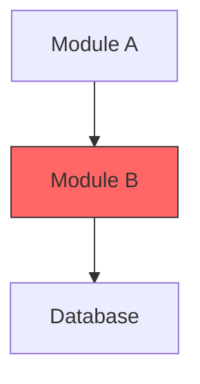
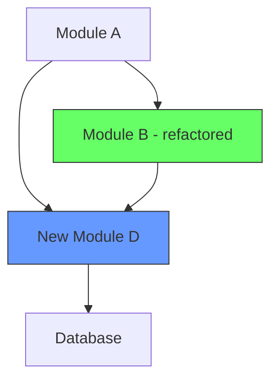

# Create GitHub PR Skill

Analyzes the current branch changes, generates a comprehensive PR description with Mermaid architecture diagrams, commits, pushes, and opens a pull request.

## Prerequisites

- Must be in a git repository
- Must have uncommitted or unpushed changes on a non-main branch
- `gh` CLI must be authenticated (`gh auth status`)

---

## Phase 0: Preflight Checks

Run these checks in parallel:

```bash
# Check 1: Confirm inside a git repo
git rev-parse --is-inside-work-tree

# Check 2: Confirm gh CLI is authenticated
gh auth status

# Check 3: Get current branch name
git branch --show-current

# Check 4: Get the default/base branch
gh repo view --json defaultBranchRef --jq '.defaultBranchRef.name'
```

**Gate:** Abort with a clear message if:
- Not in a git repo
- `gh` is not authenticated
- Current branch IS the default branch (main/master) — prompt the user to create a feature branch first

Store:
- `CURRENT_BRANCH` = current branch name
- `BASE_BRANCH` = default branch (main, master, etc.)

---

## Phase 1: Gather Context

### 1a. Collect change information (run in parallel)

```bash
# All changes: staged + unstaged + untracked
git status

# Diff of all changes against the base branch
git diff $BASE_BRANCH...HEAD

# Unstaged/staged working tree changes
git diff
git diff --cached

# Commit log since divergence from base
git log --oneline $BASE_BRANCH..HEAD

# Files changed summary
git diff --stat $BASE_BRANCH...HEAD
```

### 1b. Understand the codebase architecture

Use the Glob and Read tools to understand the project:

1. **Identify the project type** — look for package.json, Cargo.toml, go.mod, pyproject.toml, *.csproj, etc.
2. **Read key config files** — understand the tech stack, frameworks, dependencies.
3. **Read the files that were changed** — use `git diff --name-only $BASE_BRANCH...HEAD` to get the list, then Read each file (or the most important ones if there are many).
4. **Read surrounding context** — for each changed file, read related files (imports, callers, tests) to understand the before/after architecture.

### 1c. Discover and run tests/checks

Detect available test and lint commands by checking for:

| Signal | Command to run |
|--------|---------------|
| `package.json` with `scripts.test` | `npm test` or `bun test` |
| `package.json` with `scripts.lint` | `npm run lint` |
| `package.json` with `scripts.typecheck` or `scripts.check` | `npm run typecheck` or `npm run check` |
| `pytest.ini`, `pyproject.toml [tool.pytest]`, or `tests/` dir with `.py` | `uv run pytest` or `pytest` |
| `Cargo.toml` | `cargo test` and `cargo clippy` |
| `go.mod` | `go test ./...` and `go vet ./...` |
| `Makefile` with `test` target | `make test` |
| `*.csproj` | `dotnet test` |
| `.github/workflows/` | Note CI workflows but don't run them |

Run the detected commands. Capture output including:
- Total tests run / passed / failed / skipped
- Lint warnings or errors
- Type-check results
- Build success/failure

If tests fail, **do not abort** — record the failures for the PR description.

---

## Phase 2: Analyze and Synthesize

Using everything gathered in Phase 1, produce the following analysis. Think carefully about each section — the PR description is the primary deliverable of this skill.

### 2a. Problem / Task Statement

Write 2-4 sentences describing:
- **What** problem or task this PR addresses
- **Current behavior** — what happens now (the bug, limitation, or missing capability)
- **Expected behavior** — what should happen after this PR is merged
- **Why** it matters (user impact, tech debt, bug severity, etc.)
- Infer this from: branch name, commit messages, changed file names, diff content, and the `$ARGUMENTS` if provided.

### 2b. Existing Architecture (Before)

Describe the architecture of the code **before** these changes, focusing on the components that are being modified. Include a Mermaid diagram.

Guidelines for the Mermaid diagram:
- Use `graph TD` or `flowchart TD` for component/flow diagrams
- Use `sequenceDiagram` for interaction flows
- Use `classDiagram` for object/type relationships
- Keep it focused on the **relevant** parts — not the entire system
- Label nodes clearly with file/module names where applicable
- Highlight the area that is about to change

Example structure:
```

```

### 2c. Proposed Architecture (After)

Describe the architecture **after** these changes. Include a Mermaid diagram showing:
- New components introduced
- Modified relationships
- Removed dependencies
- Use green/blue highlights for new/changed nodes

Example structure:
```

```

### 2d. Key Changes Walkthrough

List the most important changes grouped logically (not file-by-file). For each group:
- What changed and why
- Any trade-offs or decisions made

### 2e. Tests & Checks Summary

Summarize results from Phase 1c:
- Which test suites ran and their results
- Lint/type-check status
- Any known issues or skipped tests
- If no tests exist, note that explicitly

---

## Phase 3: Commit & Push

### 3a. Stage and commit

Check `git status` for unstaged or untracked changes that should be included.

```bash
# Stage all relevant changes (be specific — avoid staging secrets or env files)
git add <files>

# Commit with a concise message
git commit -m "$(cat <<'EOF'
<type>: <short summary>

<optional body: 1-2 sentences of context>

Co-Authored-By: Claude Opus 4.6 <noreply@anthropic.com>
EOF
)"
```

Commit message `<type>` should be one of: `feat`, `fix`, `refactor`, `test`, `docs`, `chore`, `perf`, `style`, `ci`, `build`.

**Important:**
- Do NOT stage files matching: `.env*`, `*.pem`, `*.key`, `credentials*`, `secrets*`, `*.secret`
- If there are already commits on the branch and no new working-tree changes, skip this step.

### 3b. Push

```bash
git push -u origin $CURRENT_BRANCH
```

If the push is rejected (e.g., diverged history), inform the user and ask how to proceed. Do NOT force push.

---

## Phase 4: Create the Pull Request

Assemble the PR description from Phase 2 and create the PR.

**PR title MUST use conventional commit format:** `<type>: <concise description>`

The `<type>` prefix must be one of: `feat`, `fix`, `refactor`, `test`, `docs`, `chore`, `perf`, `style`, `ci`, `build`. Optionally include a scope: `<type>(<scope>): <description>` (e.g., `feat(auth): add OAuth2 login flow`). Infer the type from the nature of the changes — use the same logic as the commit message type in Phase 3a.

```bash
gh pr create \
  --base "$BASE_BRANCH" \
  --head "$CURRENT_BRANCH" \
  --title "<type>: <concise description, max 70 chars total>" \
  --body "$(cat <<'EOF'
## Problem / Task

<2-4 sentences from Phase 2a>

**Current behavior:** <what happens now>
**Expected behavior:** <what should happen after this PR>

## Existing Architecture

<description from Phase 2b>

```mermaid
<diagram from Phase 2b>
```

## Proposed Architecture

<description from Phase 2c>

```mermaid
<diagram from Phase 2c>
```

## Key Changes

<walkthrough from Phase 2d>

## Tests & Checks

<summary from Phase 2e>

| Check | Status | Details |
|-------|--------|---------|
| Unit Tests | ✅ / ❌ / ⏭️ | X passed, Y failed |
| Lint | ✅ / ❌ / ⏭️ | clean / N warnings |
| Type Check | ✅ / ❌ / ⏭️ | no errors / N errors |
| Build | ✅ / ❌ / ⏭️ | success / failure |

---

🤖 Generated with [Claude Code](https://claude.ai/code)

Co-Authored-By: Claude Opus 4.6 <noreply@anthropic.com>
EOF
)"
```

---

## Phase 5: Wait for CI to Pass

After the PR is created, you MUST wait for CI checks to complete before reporting back to the user. Do not return early.

### 5a. Detect CI checks

```bash
# Get the PR number from the create output (or query it)
PR_NUMBER=$(gh pr view --json number --jq '.number')

# Check if any CI checks are configured
gh pr checks $PR_NUMBER
```

If no checks are configured (command returns nothing or "no checks"), skip to Phase 5c.

### 5b. Poll CI status until completion

Use `gh pr checks` with `--watch` to block until all checks finish:

```bash
gh pr checks $PR_NUMBER --watch
```

This command blocks until all checks complete (pass or fail). Let it run — do NOT set a short timeout. Use a timeout of at least 600000ms (10 minutes).

If `--watch` is unavailable or errors, fall back to manual polling:

```bash
# Poll every 30 seconds, up to 40 attempts (20 minutes max)
for i in $(seq 1 40); do
  STATUS=$(gh pr checks $PR_NUMBER 2>&1)
  echo "$STATUS"

  # Check if all checks have completed (no "pending" or "in_progress" or "queued")
  if echo "$STATUS" | grep -qiE "pending|in_progress|queued"; then
    sleep 30
  else
    break
  fi
done
```

### 5c. Report final status

After CI completes, gather the final results:

```bash
gh pr checks $PR_NUMBER
```

Parse the output and report to the user with this format:

**If ALL checks passed:**
```
✅ PR #<number> created and all CI checks passed.
<PR URL>

CI Results:
  ✅ <check-name-1> (Xm Ys)
  ✅ <check-name-2> (Xm Ys)
```

**If ANY check failed:**
```
❌ PR #<number> created but CI checks failed.
<PR URL>

CI Results:
  ✅ <check-name-1> (Xm Ys)
  ❌ <check-name-2> (Xm Ys) — FAILED
  ✅ <check-name-3> (Xm Ys)

Failed check details:
  View logs: gh pr checks $PR_NUMBER --failed
```

When a check fails, also run `gh run view <run-id> --log-failed` if possible to surface the failure reason directly to the user.

**If CI timed out (exceeded polling limit):**
```
⏳ PR #<number> created but CI is still running after 20 minutes.
<PR URL>

Check status manually: gh pr checks $PR_NUMBER
```

**IMPORTANT:** Only report back to the user AFTER CI has completed (or timed out). The user expects to see the final CI result, not just the PR URL.

---

## Error Handling

| Scenario | Action |
|----------|--------|
| No changes to commit and no commits ahead of base | Abort: "Nothing to create a PR for." |
| Tests fail | Warn in PR description, continue creating PR |
| Push rejected | Ask user: rebase, merge, or force push? |
| PR already exists for this branch | Print existing PR URL, ask if user wants to update it |
| `gh` not installed or not authenticated | Abort with install/auth instructions |
| On default branch | Abort: "Create a feature branch first." |
| Sensitive files detected in diff | Warn user, exclude from staging, list them |
| CI checks fail | Report which checks failed, show failed log output, print PR URL |
| CI checks time out (>20 min) | Report timeout, print PR URL, give manual check command |
| No CI checks configured | Note "no CI checks configured", print PR URL, complete normally |
| `gh pr checks --watch` not supported | Fall back to manual polling loop (30s intervals, 40 attempts) |

---

## Diagram Style Guide

When generating Mermaid diagrams, follow these conventions:

- **Color coding:**
  - `fill:#f66` (red) — removed or problematic components
  - `fill:#6f6` (green) — new components
  - `fill:#69f` (blue) — modified components
  - `fill:#ff6` (yellow) — components under discussion
  - No fill — unchanged components
- **Node shapes:**
  - `[Rectangle]` — modules, services, classes
  - `([Stadium])` — entry points, APIs
  - `[(Database)]` — data stores
  - `{Diamond}` — decision points
  - `((Circle))` — events, signals
- **Edges:**
  - `-->` solid arrow — direct dependency / call
  - `-.->` dashed arrow — optional / async
  - `==>` thick arrow — data flow emphasis
- **Subgraphs** — use to group related components (e.g., `subgraph Frontend`, `subgraph Backend`)
- **Keep diagrams readable** — max ~15 nodes per diagram. Split into multiple diagrams if needed.
